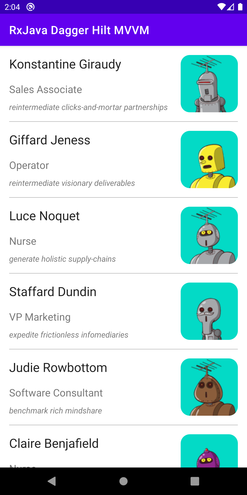
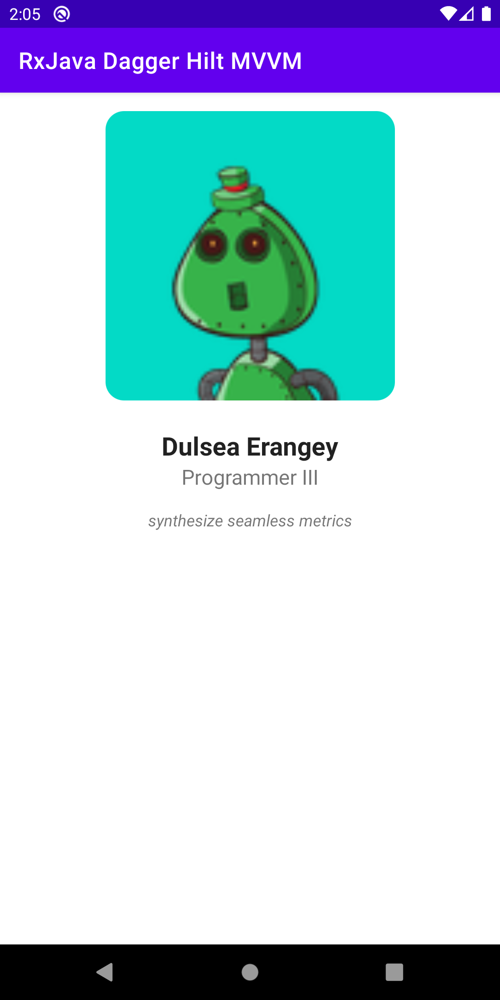

# RxJava - Dagger - Hilt - MVVM

## Libraries
- [ViewModel](https://developer.android.com/topic/libraries/architecture/viewmodel)
- [LiveData](https://developer.android.com/topic/libraries/architecture/livedata)
- [Data Binding](https://developer.android.com/topic/libraries/data-binding)
- [Room Persistence](https://developer.android.com/topic/libraries/architecture/room)
- [Retrofit2 & OkHttp3](https://github.com/square/retrofit)
- [Moshi](https://github.com/square/moshi/)
- [Material-Components](https://github.com/material-components/material-components-android)
- [Timber](https://github.com/JakeWharton/timber)
- [Coil](https://coil-kt.github.io/coil/)
- [RoundedImageView](https://github.com/vinc3m1/RoundedImageView)
- [Multidex](https://developer.android.com/studio/build/multidex)
- [RxJava3](https://github.com/ReactiveX/RxJava)
- [Dagger Hilt](https://developer.android.com/training/dependency-injection/hilt-android)

## Screenshot

## License
Licensed under the [Apache License Version 2.0](LICENSE)
